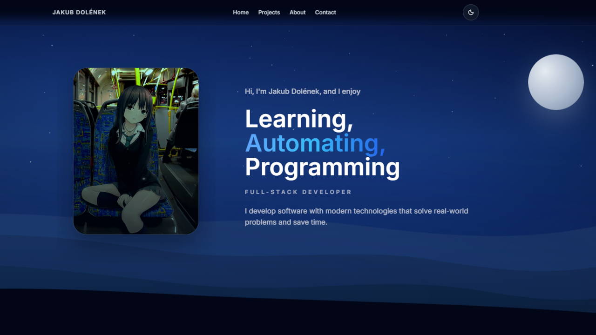

<div align="center">

# Jakub Dolének - Portfolio

**Personal portfolio of a full-stack developer focused on practical projects, process automation, and modern web technologies.**

[](https://www.jakubdolenek.xyz)
[](#technical-stack)
[](#local-setup)
[](docs/documentation.md)

[Live site](https://www.jakubdolenek.xyz) | [České README](README.md) | [Documentation](docs/documentation.md)



</div>

## What it shows

This repository is my main technical presentation. It is not just a business card, but a full React application that presents selected projects, stack, experience, and contact information in a focused way.

- Home page with `hero`, `projects`, `skills`, and `contact` sections.
- Dedicated `/about` route with experience and education timeline.
- Selected projects with demo or GitHub links.
- English and Czech localization with URL sync.
- Light and dark theme with persisted preference.
- SEO metadata, canonical/hreflang links, JSON-LD, sitemap, and robots.

## Technical stack

| Area | Technologies |
| --- | --- |
| Frontend | React 19, TypeScript 5, Vite 7 |
| Styling | Tailwind CSS 3, section CSS, responsive layout |
| Animation | Framer Motion |
| Routing | react-router-dom 7 |
| Localization | react-i18next, i18next-browser-languagedetector |
| SEO | route-aware metadata, JSON-LD, sitemap, robots.txt |

## Engineering highlights

- Project, profile, and SEO content is separated into typed data files.
- The layout uses shared provider layers for theme, scroll spy, and i18n.
- Presentation components are split by section so the site can scale cleanly.
- Canonical and alternate URLs are generated from the active route and language.
- Documentation in `docs/` describes the current architecture, setup, content models, and SEO/i18n rules.

## Local setup

```bash
npm install
npm run dev
```

The local dev server usually runs on `http://localhost:5173`.

### Available scripts

```bash
npm run dev
npm run lint
npm run typecheck
npm run build
npm run preview
```

## Documentation

Canonical documentation lives in `docs/`.

- [Documentation index](docs/documentation.md)
- [Overview](docs/overview.md)
- [Development setup](docs/development-setup.md)
- [Architecture](docs/architecture.md)
